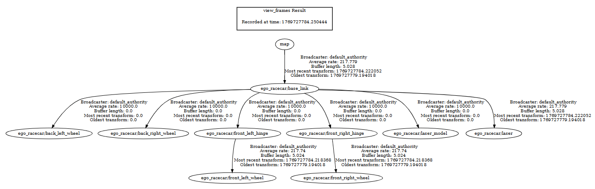
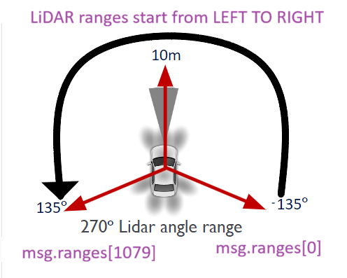
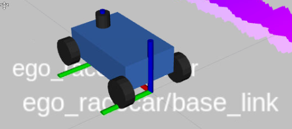

# Lab 2: Rigid Body Transforms

## Learning Goals

* Understand how to apply Rigid Body transformations in ROS 2.
* Understand how to use ROS 2 TF2 tools for monitoring transform data.
* Understand how to programmatically use the ROS 2 TF2 API.

## Lab Setup

We will build off of the local file structure given in the first lab.

```
${HOME}
  |
  +-- lab1_ws/              -- Lab 1 Workspace folder (ALWAYS BUILD HERE!)
  |     |
  |     +-- build/          -- Generated by `colcon build`
  |     |
  |     +-- log/            -- Generated by `colcon build`
  |     |
  |     +-- install/        -- Generated by `colcon build`
  |     |
  |     +-- src/            -- Source folder
  |          |
  |          +-- lab1_ws/   -- Lab 1 Package
  |
  +-- lab2_ws/              -- Lab 2 Workspace folder (ALWAYS BUILD HERE!)
  |     |
  |     :                   -- Build folders: build/ log/ install/
  |     :                   -- (present only if you build the workspace)
  |     |
  |     +-- src/            -- Source folder
  |          |
  |          +-- lab2_ws/   -- Lab 2 Package
  |
  +-- sim_ws/               -- Simulator Workspace folder
        |
        :                          -- Build folders: build/ log/ install/
        :                          -- (present only if build the workspace)
        |
        +-- src/                   -- Source folder
             |
             +-- f1tenth_gym_ros/  -- Simulator package by F1Tenth
```

> **Note on different directories**: You may choose a different directory to use for `${HOME}` for your
> setup. But these commands will assume you are using `${HOME}` for your setup.

> **Note on `~`**: Keep in mind that `~` is always replaced with your home directory, so
> `${HOME}/some_dir` and `~/some_dir` are equivalent.

To start with the lab, clone the repository:

```
cd ~
git clone https://github.com/unlv-f1/lab2 lab2_ws
```

Then, mount `~/lab2_ws` onto your Docker container (just as you've done for
Lab 1) by putting an additional line in your
`~/sim_ws/f1tenth_gym_ros/docker-compose.yml` file:

```
- ~/lab2_ws/src:/lab2_ws/src
```

Then, rebuild and run your container again.

**NOTE for those who have done the VSCode Integration**: The
`docker-compose.yml` file you are changing is NOT the one in `f1tenth_gym_ros`,
but the one you've copied into your folder root (e.g. `~`)

## Part 1: Familarizing Yourself With Transforms

### 1-1: Simulator setup

This section is a review for the commands for starting the simulator and
keyboard controller, as you've done for Lab 1.

Start your Docker container. Then, start a new terminal inside the container.
First, change your current directory to `/sim_ws` using:

```bash
cd /sim_ws
```

Set up your terminal environment by sourcing the ROS 2 underlay and `/sim_ws`
overlay:

```bash
source /opt/ros/foxy/setup.bash          # source underlay
source /sim_ws/install/local_setup.bash  # source /sim_ws overlay
```

Then, you can run the RViz simulator using:

```bash
ros2 launch f1tenth_gym_ros gym_bridge_launch.py
```

After this, in a new terminal (inside the container), run the following:

```bash
cd /sim_ws
source /opt/ros/foxy/setup.bash          # source underlay
# (no need to source any overlay since we're not using any workspace builds)
ros2 run teleop_twist_keyboard teleop_twist_keyboard
```

Have these two terminals up and running as you do the next lab.

If you need further reference, refer to Lab 1 [Section 3.2](https://github.com/unlv-f1/lab1?tab=readme-ov-file#3-launching-the-simulator) for instructions.  

### 1-2: Transforms

RViz provides a way to visualize topics as they are being published to. This
includes data such as:

* Odometry data
* Laser scan data
* Transform data
* Markers

Let's add a new visualization. To do this, click the **Add** button at the
bottom left corner of RViz. This will bring up a popup for selecting a
visualization to add. Ensure that the **By display type** tab is selected and
scroll down to **TF** and click it. Then, click the **OK** button.


The **Displays** panel on the left side of the window now includes a Display
called **TF**. This display is a visualization of the **Transform Tree**, which
is shown by the red lines drawn between each frame.

To observe how the transform frames are changing in real time, drive the car
using `teleop_twist_keyboard`.

> If you ever close one of the panels by mistake and need it back, you can
> click the **Panels** button in the upper left corner!

### 1-3: `tf2_tools view_frames.py` - Getting a Transform Tree Diagram

Let's try to generate a diagram for our transform tree. **Do not close your**
**`f1tenth_gym_ros` and your `teleop_twist_keyboard` commands.** First, start
a new terminal and run the following:

```bash
cd /sim_ws                       # be in /sim_ws folder
source /opt/ros/foxy/setup.bash  # source underlay
```

Run the following command to generate a diagram of the transform tree:

```bash
ros2 run tf2_tools view_frames.py
```

If you use `ls`, you should see two new files in your current directory, named
`frames.pdf` and `frames.gv`.

If you open `frames.pdf` with a PDF viewer, you should see the following:



>
> **Opening `frames.pdf`**
>
> For those who have integrated VS Code into your environment, you may use
> VS Code to open `frames.pdf`:
>
> ```bash
> code frames.pdf
> ```
>
> Otherwise, one way to view the PDF is to move it to a mounted folder, then
> outside the container, read it locally with a PDF viewer (e.g. Firefox PDF
> viewer, Google Chrome PDF viewer).
>

### 1-4: `tf2_ros tf2_echo` - Echoing Transformations

ROS2 also provides a way to echo the transform between two frames to the
console. In a new terminal, use the following command:

```bash
ros2 run tf2_ros tf2_echo [source_frame] [target_frame]
```

It will continuously information about the two frames. Here is an example
output:

```bash
At time 1622031731.625364060
- Translation: [2.796, 1.039, 0.000]
- Rotation: in Quaternion [0.000, 0.000, 0.202, 0.979]
At time 1622031732.614745114
- Translation: [1.608, 0.250, 0.000]
- Rotation: in Quaternion [0.000, 0.000, 0.032, 0.999]
```

> Translations are always in **meters**.

The translation from the above output will be in the form [x,y,z], while the
quaternion for rotation is [x,y,z,w]. (*Note: The quaternion [0,0,0,1] means
there is no rotation.*)

### 1-5: Monitoring `/scan`

The `f1tenth_gym_ros` simulator simulates a LiDAR inside RVIZ. This LiDAR
produces a `ranges` array which is 1080 elements long and spans 270 degrees.
Ranges are ordered, starting the rightmost range and ends at the leftmost
range. Below is an illustration of the ranges produced by the LiDAR:



These messages are sent to a topic named `/scan` in the simulator and on the
car. To monitor the `/scan` message, you can use `ros2 topic echo`:

```bash
ros2 topic echo /scan
```

Now, you may see the terminal flooded with array values because the ranges
array is so large. Limit the maximum number of array elements shown using
the `-l` flag:

```bash
ros2 topic echo /scan -l 5
```

This gives us a more manageable message:

```
header:
  stamp:
    sec: 1770106378
    nanosec: 578596207
  frame_id: ego_r...
angle_min: -2.3499999046325684
angle_max: 2.3499999046325684
angle_increment: 0.004351851996034384
time_increment: 0.0
scan_time: 0.0
range_min: 0.0
range_max: 30.0
ranges:
- 0.9857617616653442
- 0.9626373052597046
- 0.9412933588027954
- 0.9474082589149475
- 0.9492465853691101
- '...'
intensities: []
---
```

This is an instance of a `LaserScan` message. Further documentation on the 
`LaserScan` message can be found under the [Resources section](#Resources).

> **Note**: Documentation is available online for any message type.

One useful trick you can use with `-l` is examine a particular range value. For
example, if you want to examine the range at index 269, then you would use the
command:

```bash
ros2 topic echo /scan -l 270
```

This will show 270 elements of the `ranges` array, then you can look at the
last element shown for the element at index 269!

### 1-6: Changing initial vehicle position

To change the initial vehicle position of the car, edit the `sx`, `sy`,
`stheta` located in `/sim_ws/src/f1tenth_gym_ros/config/sim.yaml` (in
container). Try the test values: x=−10, y=9, θ=10 for now.

> This file is `~/sim_ws/src/f1tenth_gym_ros/config/sim.yaml` locally.

Then, since you changed the configuration, you must rebuild the container.
First, stop your instance of `f1tenth_gym_ros` then rebuild:

```bash
cd /sim_ws                       # should ALWAYS build in workspace folder
colcon build                     # creates build/, install/, log/ directories
source install/local_setup.bash  # resource overlay because it was rebuilt
```

Then, relaunch `f1tenth_gym_ros`:

```bash
ros2 launch f1tenth_gym_ros gym_bridge_launch.py
```

### 1-7: Part 1 Deliverable

Fill out the answers for the questions listed in **`SUBMISSION.md`**. You'll
use some of the techniques explained in the previous section. Ensure that it is
in your `lab2_ws` folder, which you'll be using as your Github repository,
whose link will be used for submission.

## Part 2: Using ROS 2 TF2 Programmatically

An important transformation to know is learning how to convert between your
car's laser frame and base link frame. In the simulator, these frames are
`ego_racecar/base_link` frame and `ego_racecar/laser` frame. Now, on the
physical car itself, the frames are a little different, where it is simply
`/laser` and `/base_link`, so it's important to keep this in mind.



In this section, you'll be applying your knowledge of Rigid Body transforms
to convert the range at degree 0 (in front of the car) from the laser frame
to the base frame.

### 2-1: Deliverable Specification

Your deliverable for this section will be a single package named `lab2_pkg`
containing a single node called `transformer_node`. This node will subscribe to 
the `/scan` topic for `LaserScan` messages. Then, **every 2 seconds**, it takes
the latest range at degree 0 (in front of the car) and logs its coordinates 
both in the **laser frame** and in the **base (link) frame**.

Your package must also contain a launch file, such that you can launch
`transformer_node` in the simulator using:

```
ros2 launch lab2_pkg lab2_launch.py
```

### 2-2: Base Code

To start, create your package using the `ros2 pkg create` command:

```bash
cd /lab2_ws/src
ros2 pkg create --build-type ament_python lab2_pkg
```

Then, add the following dependencies in `/lab2_ws/src/lab2_pkg/package.xml`:

```xml
<depend>rclpy</depend>
<depend>sensor_msgs</depend>
<exec_depend>ros2launch</exec_depend>
```

Make sure these are installed using:

```bash
cd /lab2_ws
apt-get update
rosdep install --from-paths src --ignore-src -y
```

Then, in `/lab2_ws/src/lab2_pkg/lab2_pkg`, create a new file named
`transformer.py`. Make sure to add an entry point for it in
`/lab2_ws/src/lab2_pkg/setup.py`. Then, copy and paste the following base code
in `transformer.py`:

```python
from typing import Optional
import rclpy
import rclpy.time
from rclpy.node import Node
from sensor_msgs.msg import LaserScan
from tf2_ros import TransformException  # type: ignore
from tf2_ros.buffer import Buffer
from tf2_ros.transform_listener import TransformListener


class TransformerNode(Node):
    def __init__(self) -> None:
        super().__init__("transformer_node")

        self.declare_parameter("base_frame")
        self.declare_parameter("laser_frame")

        self.create_subscription(LaserScan, "/scan", self.scan_callback, 10)

        self.create_timer(2.0, self.timer_callback)

        self.tf_buffer = Buffer()  # Where transform data is stored
        self.tf_listener = TransformListener(self.tf_buffer, self)

        self.latest_scan_msg: Optional[LaserScan] = None

    def scan_callback(self, scan_msg: LaserScan) -> None:
        self.latest_scan_msg = scan_msg

    def timer_callback(self) -> None:
        if self.latest_scan_msg is None:
            return

        # TODO: GET RANGE AT 0 DEGREES; REPLACE 1000 WITH INDEX OF FORWARD
        forward_range = self.latest_scan_msg.ranges[1000]

        base_frame = self.get_parameter("base_frame").value
        laser_frame = self.get_parameter("laser_frame").value

        try:
            transform_laser_to_base = self.tf_buffer.lookup_transform(
                base_frame,
                laser_frame,
                rclpy.time.Time(),
            )
        except TransformException:
            self.get_logger().info("Could not look up transformation, skipping...")
            return

        # TODO: DO YOUR MATH HERE (See TransformStamped documentation)
        #   Replace ... with your answers!

        x_laser = ...
        y_laser = ...
        x_base = ...
        y_base = ...

        self.get_logger().info(
            f"Coordinates of range at 0 deg in laser frame: {x_laser, y_laser}"
        )
        self.get_logger().info(
            f"Coordinates of range at 0 deg in base frame: {x_base, y_base}"
        )


def main() -> None:
    rclpy.init()
    node = TransformerNode()
    rclpy.spin(node)
    rclpy.shutdown()
```

Explanations for the base code:

* `__init__`
  * Declares two required parameters for your laser frame and base frames.
  * Subscribes to `/scan` and uses `scan_callback` as the callback.
  * Creates a timer and uses `timer_callback` as the callback.
  * Creates a `Buffer` object, which stores Transform data
  * Creates a `TransformListener` which listens to the `/tf` topic and fills
    the buffer as it receives more data.
* `scan_callback`
  * Stores the latest scan message received.
* `timer_callback`
  * If no scan message is availabe, immediately returns
  * Gets base and laser frame names
  * Looks up laser frames, covering the case where it fails as well.
  * Logs to the console

### 2-3: Your Tasks

Your tasks will be to follow the instructions in the two `TODO` sections to
finish the code.

Then, create a launch file and add it as a data file in `setup.py`.

Once built, the following command should launch node with the laser frame being
`ego_racecar/laser` and the base frame being `ego_racecar/base_link`:

```bash
ros2 launch lab2_pkg lab2_launch.py
```

> **Optional Task**
> 
> The transform between the laser frame and base frame is static, and thus,
> you could permanently store the transform data in an attribute in
> `__init__`. However, the issue is that `self.tf_buffer.lookup_transform`
> may not have received the transform data yet, raising a `TranformException`.
> In the base code, the call to `self.tf_buffer.lookup_transform` is inside
> the `timer_callback` method, not the `__init__` method.
>
> Question: How could you make it so that `self.tf_buffer.lookup_transform` is
> only ever called once? (Hint: It has a fourth (optional) parameter.)

## Overall Deliverables and Submission

Publish and upload your `lab2_ws` as a *private* Github repository. Share your
collaboration rights with the TA as a collaborator, and submit a link to the
repository on canvas.

Checklist:

* `SUBMISSION.md` file filled out and present in repository.
* `lab2_pkg/` package present in repository.

## Grading Rubric

- SUBMISSION.md Responses: **50** Points
- `lab2_pkg` Functionality Working: **50** Points

## Resources

- [Adding Collaborator to GitHub](https://docs.github.com/en/account-and-profile/setting-up-and-managing-your-personal-account-on-github/managing-access-to-your-personal-repositories/inviting-collaborators-to-a-personal-repository)

- [**LaserScan** Documentation](https://docs.ros.org/en/noetic/api/sensor_msgs/html/msg/LaserScan.html)
